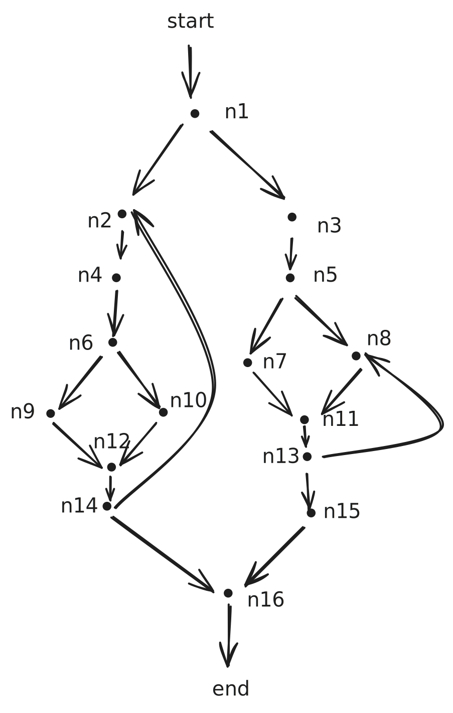
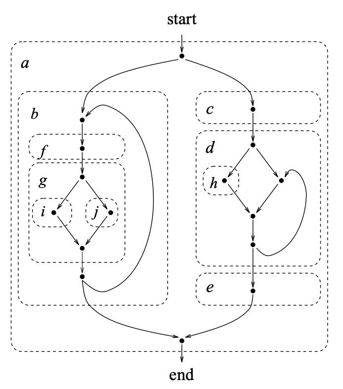
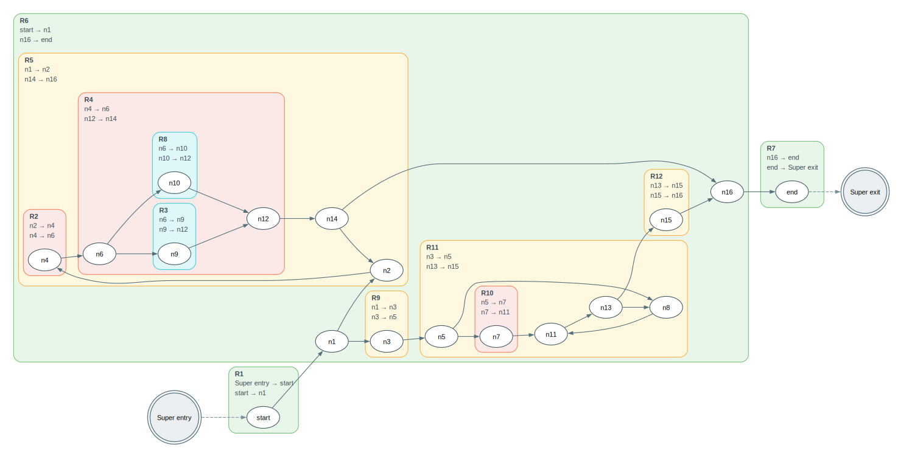

# SESE Regions

Python implementation of the Johnson-Pearson-Pingali algorithm for
computing canonical single-entry/single-exit (SESE) regions and building
the Program Structure Tree (PST) for directed graphs. The implementation
adds a super-entry and super-exit when the input has multiple entries or
exits, and provides Graphviz DOT exporters for visualization.

<div align="center">
  <br>
  Region output for the diamond graph example
</div>

## Worked example with loops

This worked example mirrors the more complex control-flow graph from Figure 1a
in [1], including back edges and nested structure. The generated CFG-with-regions
output uses the same adjacency list to highlight how the PST groups regions.

<div align="center">
  <table align="center">
    <tr>
      <td align="center">
        <br>
        Hand-transcribed Figure 1a from [1] graph with node labels
      </td>
      <td align="center">
        <br>
        Figure 1a from [1]
      </td>
    </tr>
    <tr>
      <td align="center" colspan="2">
        <br>
        Generated CFG regions for Figure 1a adjacency list
      </td>
    </tr>
  </table>
</div>

## What is included

- `sese/pst.py` core PST construction (`compute_pst`) using cycle equivalence
  in linear time.
- `sese/visualize.py` DOT exporters for the CFG, PST, and CFG-with-regions.
- `sese/tests/` unit tests with a brute-force oracle on small graphs.

## Quick start

```bash
python3 - <<'PY'
from sese.pst import compute_pst
from sese.visualize import cfg_with_regions_to_dot

adj = {
    "S": {"out": ["A"], "in": []},
    "A": {"out": ["B", "C"], "in": ["S"]},
    "B": {"out": ["D"], "in": ["A"]},
    "C": {"out": ["D"], "in": ["A"]},
    "D": {"out": ["T"], "in": ["B", "C"]},
    "T": {"out": [], "in": ["D"]},
}

result = compute_pst(adj)
open("cfg_regions.dot", "w").write(cfg_with_regions_to_dot(result))
print("wrote cfg_regions.dot")
PY
```

Render the DOT file:

```bash
dot -Tpng cfg_regions.dot -o cfg_regions.png
```

Generate the bundled visualizations (writes SVGs to `images/`):

```bash
python3 generate_viz.py
```

Run tests:

```bash
python3 -m unittest discover -s sese/tests
```

## References

[1] Johnson, Richard, David Pearson, and Keshav Pingali. "The program structure tree: Computing control regions in linear time." Proceedings of the ACM SIGPLAN 1994 conference on Programming language design and implementation. 1994.
